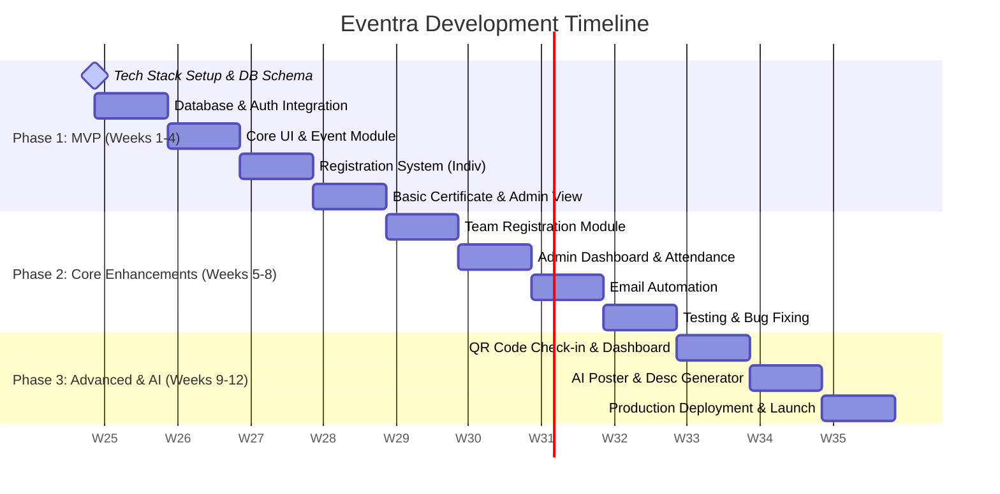

# Eventra: College Event Management Platform Roadmap

Eventra is designed to be a modern, feature-rich college event management platform that simplifies event creation, registration (both individual and team), check-ins, and certificate generation. 

This roadmap outlines the journey from a Minimum Viable Product (MVP) to a fully-featured, production-ready application.

---

## 📅 Timeline Overview



---

## 🛠️ Recommended Tech Stack

To build a premium, fast, and scalable platform, we recommend the following stack:

| Layer | Technology | Rationale |
| :--- | :--- | :--- |
| **Frontend** | [Next.js (App Router)](https://nextjs.org/) + [React](https://react.dev/) | React Server Components for fast initial loads, SEO, and seamless routing. |
| **Styling** | [Tailwind CSS](https://tailwindcss.com/) + [shadcn/ui](https://ui.shadcn.com/) | Radix UI primitives with Tailwind styling for a premium, accessible, and themeable UI. |
| **Icons** | [Lucide React](https://lucide.dev/) | Consistent, lightweight vector icons. |
| **Database** | [PostgreSQL (via Supabase or Neon)](https://supabase.com/) | Relational database ideal for transactional data (Registrations $\leftrightarrow$ Users $\leftrightarrow$ Events). |
| **ORM** | [Prisma](https://www.prisma.io/) or [Drizzle ORM](https://orm.drizzle.team/) | Type-safe queries and easy migrations. |
| **Authentication** | [Clerk](https://clerk.com/) or [Supabase Auth](https://supabase.com/docs/guides/auth) | Clerk offers out-of-the-box social login, user profiles, and organization/role management. |
| **PDF Generation** | [`@react-pdf/renderer`](https://react-pdf.org/) | Renders high-quality PDF certificates on the client or server side using React components. |
| **File Storage** | [Supabase Storage](https://supabase.com/docs/guides/storage) or [Uploadthing](https://uploadthing.com/) | Storing organizer signatures, event banner images, and generated certificates. |
| **Email Service** | [Resend](https://resend.com/) + [React Email](https://react.email/) | Simple API for sending transactional emails with beautiful React-designed templates. |

---

## 🗄️ Database Schema Design (Relational PostgreSQL)

```mermaid
erDiagram
    USER ||--o{ REGISTRATION : register
    USER ||--o{ CERTIFICATE : receives
    EVENT ||--o{ REGISTRATION : contains
    EVENT ||--o{ CERTIFICATE : issues
    TEAM ||--o{ REGISTRATION : forms
    TEAM ||--o{ TEAM_MEMBER : has

    USER {
        string id PK "Clerk/Auth User ID"
        string email UNIQUE
        string name
        string college
        string phone
        string role "STUDENT | ADMIN | ORGANIZER"
        datetime createdAt
    }

    EVENT {
        string id PK
        string title
        string category "TECHNICAL | NON_TECHNICAL"
        string description
        string bannerUrl
        datetime eventDate
        string venue
        datetime registrationDeadline
        int maxTeamSize
        int minTeamSize
        string prizePool
        string organizerId FK
        datetime createdAt
    }

    TEAM {
        string id PK
        string name
        string leaderId FK
        string inviteCode UNIQUE
    }

    TEAM_MEMBER {
        string id PK
        string teamId FK
        string userId FK
        string status "PENDING | ACCEPTED"
    }

    REGISTRATION {
        string id PK
        string eventId FK
        string userId FK "null if registered as team"
        string teamId FK "null if registered as individual"
        string status "PENDING | CONFIRMED | CANCELLED"
        datetime registeredAt
    }

    CERTIFICATE {
        string id PK
        string userId FK
        string eventId FK
        string certificateType "PARTICIPATION | WINNER | RUNNER_UP | VOLUNTEER"
        string downloadUrl
        string verificationToken UNIQUE
        datetime issuedAt
    }
```

---

## 🚀 Phased Execution Plan

### 📍 Phase 1: MVP Setup & Authentication (Weeks 1-2)
* **Goal**: Build the core interface, allow users to sign up, and view/create events.
* **Tasks**:
  - Initialize the Next.js workspace with Tailwind CSS and `shadcn/ui`.
  - Set up PostgreSQL on Neon or Supabase and initialize Prisma schema.
  - Implement Clerk/Supabase Authentication (Google + Email provider).
  - Design the main page layout, navigation header, and dark mode theme.
  - Create the Event Model and build basic Event Browsing pages.
* **Milestone**: Users can log in, view a list of events, and see event details.

### 📍 Phase 2: Core Event & Registration System (Weeks 3-4)
* **Goal**: Enable individual registration, organizer creation tools, and basic validation.
* **Tasks**:
  - Build Admin/Organizer forms to create, edit, and delete events.
  - Implement single-student registration with database entries.
  - Create the Student Dashboard showcasing "My Registered Events".
  - Create the Admin Panel displaying registered participants for each event.
* **Milestone**: A student can successfully register for an event, and the admin can view the list of participants.

### 📍 Phase 3: Team Registrations & Certificates (Weeks 5-7)
* **Goal**: Support complex registrations (teams) and automated certificate generation.
* **Tasks**:
  - Add team registration logic: A user creates a team, receives an invite code, and shares it with teammates who join the team.
  - Implement PDF certificate generation with dynamic fields (Name, Event Name, Date, Certificate Type).
  - Upload certificates to Storage and send a download link to students.
  - Generate a verification QR code printed directly on the certificate linking back to a public verification page on Eventra.
* **Milestone**: Teams can register together; admins can generate and email verified PDF certificates with QR codes.

### 📍 Phase 4: Attendance, Dashboards & Automation (Weeks 8-9)
* **Goal**: Automate organizer operations, handle check-ins, and send notifications.
* **Tasks**:
  - Build a responsive Admin Analytics Dashboard showing registrations over time, category breakdowns, and ticket counts.
  - Set up Resend to email confirmation notices immediately after registration.
  - Add simple check-in logic: Organizer can mark users as "Attended" or "Absent".
* **Milestone**: Organizers get a dashboard showing event popularity, and students receive instant email updates.

### 📍 Phase 5: Advanced & AI Features (Weeks 10-11)
* **Goal**: Add check-in validation via QR codes, plus AI helpers for event hosts.
* **Tasks**:
  - Generate a unique check-in QR code for each registered student (accessible from their dashboard).
  - Build a mobile-friendly scan page for organizers to quickly check in attendees using their phone camera.
  - Add AI features (optional but highly recommended for hackathons):
    - **AI Description Helper**: Uses OpenAI/Gemini to write professional descriptions based on event titles and short notes.
    - **AI Chatbot**: A simple FAQ assistant helper on the event landing pages.
* **Milestone**: Seamless day-of-event check-ins via QR scanner, and automated description generation for admins.

---

## 💡 Pro Tips for a Winning Hackathon Project
1. **Focus on the Dashboard and Certificate Generator**: These are the features that "wow" judges because they automate tedious manual processes.
2. **Beautiful Design System**: Use dark mode as the default or build a seamless toggle. Incorporate clean cards, hover animations, and crisp typography (like *Inter* or *Plus Jakarta Sans*).
3. **Mock Data Seeding**: Create a script `prisma/seed.ts` containing 10+ realistic events (technical hackathons, game design tournaments, treasure hunts, debate clubs) with high-quality stock banner images so the site looks alive from day one.
